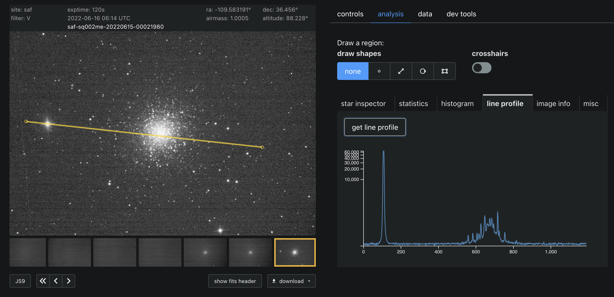
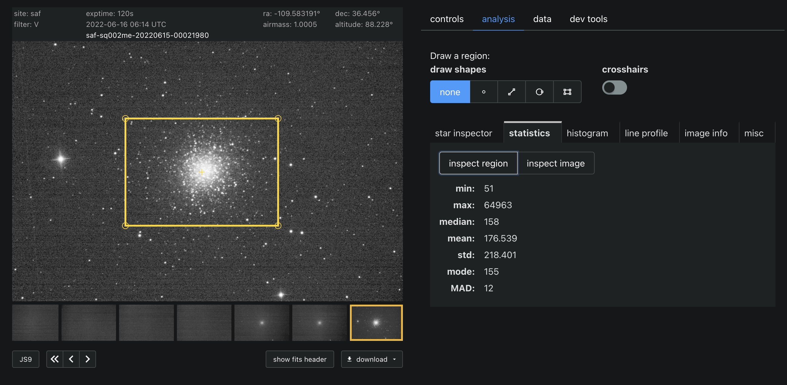
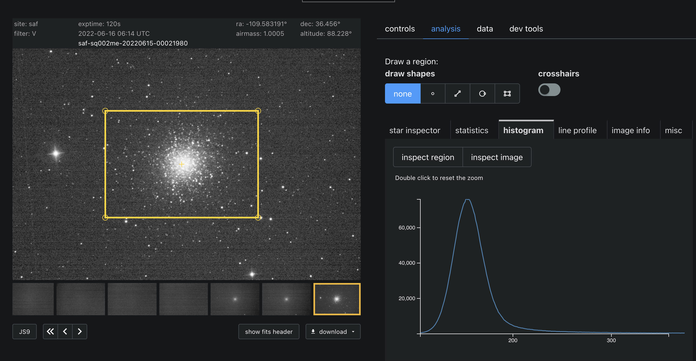

# QuickAnalysis

[](https://coveralls.io/github/LCOGT/quickanalysis?branch=main)

Users running a real-time observing session with the Photon Ranch web application need to verify the quality of their incoming images.
QuickAnalysis is a server for running image analysis tasks that will make this verification faster and easier than having users download images for local analysis.

## Description

This repository defines the server-side image analysis for Photon Ranch observing sessions. To assess the quality of incoming images, users can get a line profile for a given line, as well as statistics (mean, mode, median, min, max, std, median abs deviation) or a histogram of their image or of a rectangular subregion of their image.

Example use of the different API endpoints in the frontend are shown below.







## Local Development

### **Configure AWS Credentials**

This application is designed to work with the AWS configuration used by photon ranch. 
Ensure your system has the appropriate photon ranch [AWS credentials and config files](https://docs.aws.amazon.com/cli/latest/userguide/cli-configure-files.html) in order to run this application on your machine.

### **Set up a [virtual environment](https://docs.python.org/3/tutorial/venv.html)**

Using a virtual environment is highly recommended. Run the following commands from the base of this project. `(venv)`
is used to denote commands that should be run using your virtual environment.

    python3 -m venv venv
    source venv/bin/activate
    (venv) pip install -r requirements.txt

### **Run the tests**

    (venv) python -m pytest

### **Run the application**

    (venv) python application.py

The quickanalysis server should now be accessible from <http://127.0.0.1:5000>!

## API Endpoints

This server is accessible at http://quickanalysis.photonranch.org/.
Available endpoints are described below:

- POST `/lineprofile`
  - Description:  Given the filename of an image in Photon Ranch and a line (start and end point), return an array of intensities. The points defining the line are relative to the image dimensions. (e.g. (0.5, 0.5) would be a point in the middle of the image.) 
  - Authorization required: No
  - Request body:
    - start (dict): 'x' and 'y' values for the line start point, in [0, 1]
    - end (dict): Same as start
    - full_filename (str): Photon Ranch filename in S3, including the extension.
    - s3_directory (str): the 'folder' that the image resides in s3. [ data | info-images | allsky ]
  - Responses:
    - 200: Returns a JSON body with the following:
      - success (boolean): Successful line profile
      - start (dict): Same as request body
      - end (dict): Same as request body
      - data (list): of intensity values between start and end point
    - 400: Image does not exist or validation error
    - 500: Exception
  - Example request:

    ```python
    #python 3.7
    import requests, json
    url = "http://quickanalysis.photonranch.org/lineprofile"
    body = json.dumps({ 
        "full_filename": "tst-test-20201112-00000058-EX10.fits.bz2",             
        "s3_directory": "data",
        # return the intensity profile for the line spanning the top left to bottom right corners.
        "start": {
            "x": 0,
            "y": 0,
        },
        "end": {
            "x": 1,
            "y": 1,
        }
    })
    requests.post(url, body).json()
    """
    {
        "success": true,
        "data": [ ... 260.0, 255.0, 237.0 ... ], 
        "start": [
            0, 
            0
        ], 
        "end": [
            1, 
            1
        ]
    }
    """
    ``` 

  - GET `/lineprofiledisplay`
    - Description: Visualizes the line for line profile described above
    - Authorization required: No
    - Request body:
        - x0 (float): 'x' value for the line start point
        - x1 (float): 'x' value for the line end point
        - y0 (float): 'y' value for the line start point
        - y1 (float): 'y' value for the line end point
        - filename (str): Photon Ranch filename in S3, including the extension.
        - s3_directory (str): The 'folder' that the image resides in s3. [ data | info-images | allsky ]
    - Responses:
        - 200: Returns a base 64 string representing a png of a line profile plot
    - Example request:
    ```python
        #python 3.7
        import requests, json
        url = "http://quickanalysis.photonranch.org/lineprofiledisplay"
        body = json.dumps({ 
            "filename": "tst-test-20201112-00000058-EX10.fits.bz2",             
            "s3_directory": "data",
            # return the intensity profile for the line spanning the top left to bottom right corners.
            "x0": 0,
            "y0": 0,
            "x1": 1,
            "y1": 1,
        })
        requests.post(url, body).json()
    ``` 

  - POST `/statistics`
    - Description: Returns statistics for an image or rectangular subregion.
    - Authorization required: No
    - Request body:
        - subregion (dict): Optional description of the subregion including:
          - x0 (float): 'x' value for the rectangle left edge
          - x1 (float): 'x' value for the rectangle right edge
          - y0 (float): 'y' value for the rectangle top edge
          - y1 (float): 'y' value for the rectangle bottom edge
        - full_filename (str): Photon Ranch filename in S3, including the extension.
        - s3_directory (str): The 'folder' that the image resides in s3. [ data | info-images | allsky ]
    - Responses:
        - 200: Returns a JSON body of stats floats including median, mean, mode, min, max, std, median abs deviation (see example below)
        - 400: Image does not exist.
    - Example request:
    ```python
        #python 3.7
        import requests, json
        url = "http://quickanalysis.photonranch.org/statistics"
        body = json.dumps({ 
            "full_filename": "tst-test-20201112-00000058-EX10.fits.bz2",             
            "s3_directory": "data",
        })
        requests.post(url, body).json()
         """
        {
            "success": True,
            "stats": {
                "median": 158,
                "mean": 176.539,
                "mode": 155,
                "min": 51,
                "max": 64963,
                "std": 218.401,
                "median_abs_deviation": 12,
            }
            "params": json.loads(request.data)
        }
        """
    ``` 
  - POST `/histogram-clipped`
    - Description: Returns histogram statistics for an image or rectangular subregion.
    - Authorization required: No
    - Request body:
        - clip_percent (float): percentile value of intensity to define min and max range of histogram
        - subregion (dict): Optional description of the subregion including:
          - x0 (float): 'x' value for the rectangle left edge
          - x1 (float): 'x' value for the rectangle right edge
          - y0 (float): 'y' value for the rectangle top edge
          - y1 (float): 'y' value for the rectangle bottom edge
        - full_filename (str): Photon Ranch filename in S3, including the extension.
        - s3_directory (str): The 'folder' that the image resides in s3. [ data | info-images | allsky ]
    - Responses:
        - 200: Returns a JSON body of counts, edges, and stats floats including median, mean, mode, min, max, (see example below)
        - 400: Image does not exist.
    - Example request:
    ```python
        #python 3.7
        import requests, json
        url = "http://quickanalysis.photonranch.org/histogram-clipped"
        body = json.dumps({ 
            "full_filename": "tst-test-20201112-00000058-EX10.fits.bz2",             
            "s3_directory": "data",
            "clip_percent": 0.001,
        })
        requests.post(url, body).json()
         """
        {
            "success": True,
            "histogram": {
                "edges": [106, 107, ... 1405],
                "counts": [415, 438, ....4152],
                "stats": {
                        "median": 158,
                        "mean": 176.539,
                        "mode": 155,
                        "min": 51,
                        "max": 64963,
                }
            },
            "params": json.loads(request.data)
        }
        """
    ``` 